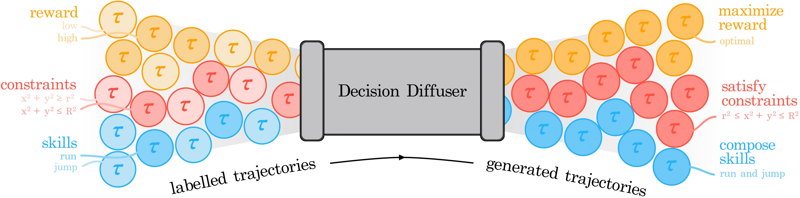

# Is Conditional Generative Modeling all you need for Decision-Making? 
<div align="center">

[[Website]](https://anuragajay.github.io/decision-diffuser/)
[[arXiv]](https://arxiv.org/abs/2211.15657)
[[PDF]](https://arxiv.org/pdf/2211.15657.pdf)



</div>

Recent improvements in conditional generative modeling have made it possible to generate high-quality images from language descriptions alone. We investigate whether these methods can directly address the problem of sequential decision-making. We view decision-making not through the lens of reinforcement learning (RL), but rather through conditional generative modeling. To our surprise, we find that our formulation leads to policies that can outperform existing offline RL approaches across standard benchmarks. By modeling a policy as a return-conditional diffusion model, we illustrate how we may circumvent the need for dynamic programming and subsequently eliminate many of the complexities that come with traditional offline RL. We further demonstrate the advantages of modeling policies as conditional diffusion models by considering two other conditioning variables: constraints and skills. Conditioning on a single constraint or skill during training leads to behaviors at test-time that can satisfy several constraints together or demonstrate a composition of skills. Our results illustrate that conditional generative modeling is a powerful tool for decision-making. 

In this repo, we provide training and evaluation code for Decision Diffuser. We are in process of integrating Decision Diffuser into 🤗 Diffusers (the Hugging Face diffusion model library).

# Installation
```
conda env create -f environment.yml
conda activate decdiff
export PYTHONPATH=/path/to/decision-diffuser/
```

# Training and Evaluation
To start training decision diffuser, run the following commmands

```bash
cd analysis
python train.py
```

To evaluate the trained model, run the following commmands
```bash
cd analysis
python eval.py
```

You can modify the training and evaluation configuration by appropriately changing `analysis/default_inv.py`.

# Reference

```bibtex
@article{ajay2022conditional,
  title={Is Conditional Generative Modeling all you need for Decision-Making?},
  author={Ajay, Anurag and Du, Yilun and Gupta, Abhi and Tenenbaum, Joshua and Jaakkola, Tommi and Agrawal, Pulkit},
  journal={arXiv preprint arXiv:2211.15657},
  year={2022}
}
```
# Contact

In case of any confusion, please email aajay@mit.edu.

# Acknowledgements

The codebase is derived from [diffuser repo](https://github.com/jannerm/diffuser/).